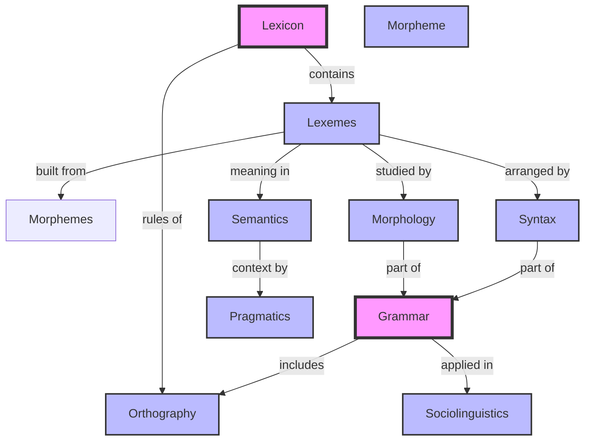
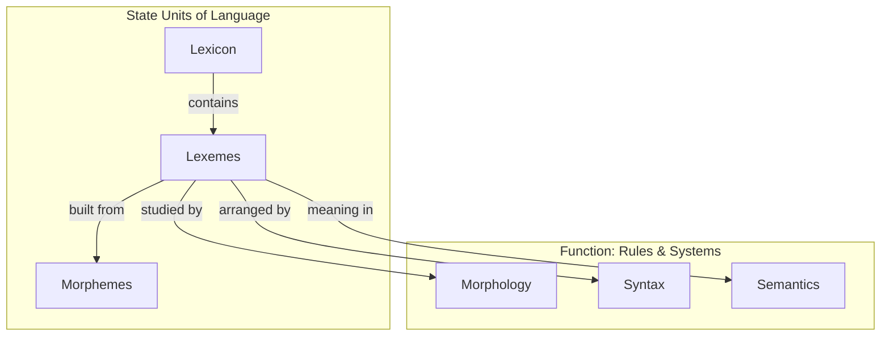
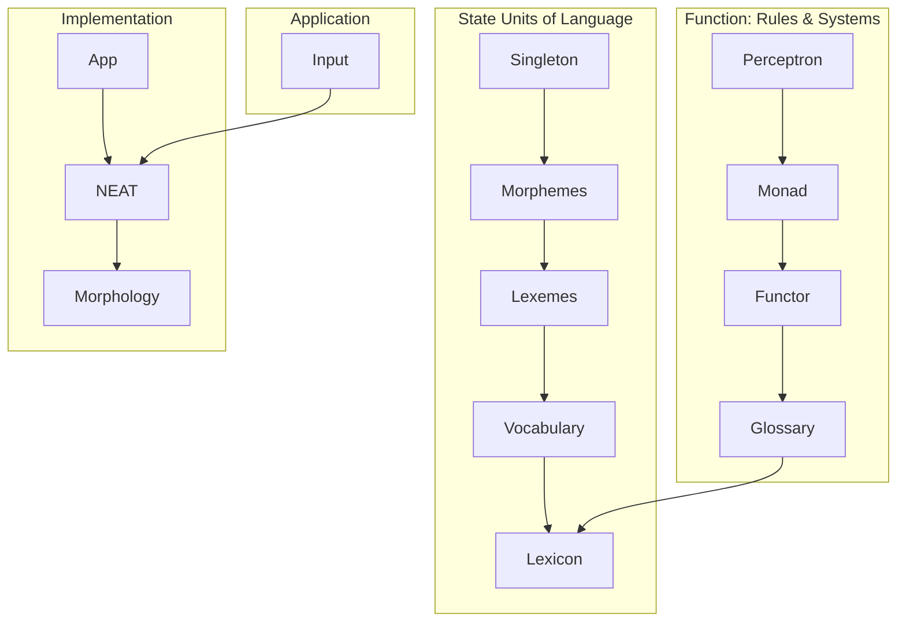

```mermaid
graph TD
    Lexicon -->|contains| Lexemes
    Lexemes -->|built from| Morphemes
    Lexemes -->|studied by| Morphology
    Morphology -->|part of| Grammar
    Lexemes -->|arranged by| Syntax
    Syntax -->|part of| Grammar
    Lexicon -->|rules of| Orthography
    Lexemes -->|meaning in| Semantics
    Semantics -->|context by| Pragmatics
    Grammar -->|includes| Orthography
    Grammar -->|applied in| Sociolinguistics
    style Lexicon fill:#f9f,stroke:#333,stroke-width:4px
    style Morpheme fill:#bbf,stroke:#333,stroke-width:2px
    style Lexemes fill:#bbf,stroke:#333,stroke-width:2px
    style Syntax fill:#bbf,stroke:#333,stroke-width:2px
    style Semantics fill:#bbf,stroke:#333,stroke-width:2px
    style Pragmatics fill:#bbf,stroke:#333,stroke-width:2px
    style Morphology fill:#bbf,stroke:#333,stroke-width:2px
    style Grammar fill:#f9f,stroke:#333,stroke-width:4px
    style Orthography fill:#bbf,stroke:#333,stroke-width:2px
    style Sociolinguistics fill:#bbf,stroke:#333,stroke-width:2px
```

---

```mermaid
graph TD;
    subgraph State[State Units of Language]
        Lexicon -->|contains| Lexemes
        Lexemes -->|built from| Morphemes
    end

    subgraph Function[Function: Rules & Systems]
        Lexemes -->|studied by| Morphology
        Lexemes -->|arranged by| Syntax
        Lexemes -->|meaning in| Semantics
    end


```

---

```mermaid
graph TD;
    subgraph State[State Units of Language]
        Singleton --> Morphemes;
        Morphemes --> Lexemes;
        Lexemes --> Vocabulary;
        Vocabulary --> Lexicon;
    end

    subgraph Function[Function: Rules & Systems]
        Perceptron --> Monad;
        Monad --> Functor;
        Functor --> Glossary;
        Glossary --> Lexicon;
    end

    subgraph Implementation
        App --> NEAT;
        NEAT --> Morphology;
    end
    
	subgraph Application
        Input --> NEAT;
    end
```
