Payment
Settlement
Clearing
Invoice
Billing
Receipt
Confirmation

Payment Authorization
Funds Transfer
Escrow
Disbursement
Reconciliation
Refund
Chargeback
Transaction Fee
Payment Gateway
Point of Sale (POS)
Checkout
Order Fulfillment
Supply Chain
Portfolio,  Returns, Security, Valuation,Evaluation,Ownership, Appreciation,Depreciation, Encumbrance,Pricing,  Inventory, Import, Package, Manifest, Logistics 
Export, Trade, Buy, Sell, Loan, Rent,Escrow, Requirement,  Dependency, 
Exchange
Price
Value

```mermaid 
graph TD;

Asset_Procurement-->|Level 1| Procurement
Asset_Procurement-->|Level 1| Evaluation
Asset_Procurement-->|Level 1| Ownership
Asset_Procurement-->|Level 1| Pricing

Procurement-->|Level 2| Purchase
Procurement-->|Level 2| Acquisition

Evaluation-->|Level 2| Valuation
Evaluation-->|Level 2| Assessment

Ownership-->|Level 2| Transfer
Ownership-->|Level 2| Registration

Pricing-->|Level 2| Negotiation
Pricing-->|Level 2| Costing

Purchase-->|Level 3| Trade
Purchase-->|Level 3| Exchange

Acquisition-->|Level 3| Investment
Acquisition-->|Level 3| Lease

Valuation-->|Level 3| Appraisal
Valuation-->|Level 3| Assessment

Assessment-->|Level 3| Analysis
Assessment-->|Level 3| Evaluation

Transfer-->|Level 3| Sale
Transfer-->|Level 3| Transfer_of_Rights

Registration-->|Level 3| Documentation
Registration-->|Level 3| Legalization

Negotiation-->|Level 3| Bargaining
Negotiation-->|Level 3| Dealmaking

Purchase-->|Level 4| Payment
Purchase-->|Level 4| Confirmation

Acquisition-->|Level 4| Funding
Acquisition-->|Level 4| Lease_Agreement

Valuation-->|Level 4| Valuation_Report
Valuation-->|Level 4| Assessment_Criteria

Registration-->|Level 4| Registration_Form
Registration-->|Level 4| Legal_Documents

Asset_Disbursement-->|Level 1| Disbursement
Asset_Disbursement-->|Level 1| Distribution
Asset_Disbursement-->|Level 1| Fulfillment
Asset_Disbursement-->|Level 1| Settlement

Disbursement-->|Level 2| Allocation
Disbursement-->|Level 2| Payment

Distribution-->|Level 2| Logistics
Distribution-->|Level 2| Delivery

Fulfillment-->|Level 2| Service
Fulfillment-->|Level 2| Product

Settlement-->|Level 2| Closure
Settlement-->|Level 2| Finalization

Allocation-->|Level 3| Resource_Allocation
Allocation-->|Level 3| Budget_Allocation

Payment-->|Level 3| Payment_Method
Payment-->|Level 3| Payment_Confirmation

Logistics-->|Level 3| Shipping
Logistics-->|Level 3| Transportation

Delivery-->|Level 3| Delivery_Schedule
Delivery-->|Level 3| Delivery_Confirmation

Service-->|Level 3| Service_Agreement
Service-->|Level 3| Service_Completion

Product-->|Level 3| Product_Shipment
Product-->|Level 3| Product_Receipt

Closure-->|Level 3| Closure_Documentation
Closure-->|Level 3| Closure_Confirmation

Asset_Handling-->|Level 1| Management
Asset_Handling-->|Level 1| Maintenance
Asset_Handling-->|Level 1| Utilization
Asset_Handling-->|Level 1| Optimization

Management-->|Level 2| Inventory
Management-->|Level 2| Tracking

Maintenance-->|Level 2| Repair
Maintenance-->|Level 2| Upkeep

Utilization-->|Level 2| Usage
Utilization-->|Level 2| Deployment

Optimization-->|Level 2| Efficiency
Optimization-->|Level 2| Enhancement

```

```mermaid 
graph TD;

Asset_Procurement-->|Level 1| Procurement
Asset_Procurement-->|Level 1| Evaluation
Asset_Procurement-->|Level 1| Ownership
Asset_Procurement-->|Level 1| Pricing

Procurement-->|Level 2| Purchase
Procurement-->|Level 2| Acquisition

Evaluation-->|Level 2| Valuation
Evaluation-->|Level 2| Assessment

Ownership-->|Level 2| Transfer
Ownership-->|Level 2| Registration

Pricing-->|Level 2| Negotiation
Pricing-->|Level 2| Costing

Purchase-->|Level 3| Trade
Purchase-->|Level 3| Exchange

Acquisition-->|Level 3| Investment
Acquisition-->|Level 3| Lease

Valuation-->|Level 3| Appraisal
Valuation-->|Level 3| Assessment

Assessment-->|Level 3| Analysis
Assessment-->|Level 3| Evaluation

Transfer-->|Level 3| Sale
Transfer-->|Level 3| Transfer_of_Rights

Registration-->|Level 3| Documentation
Registration-->|Level 3| Legalization

Negotiation-->|Level 3| Bargaining
Negotiation-->|Level 3| Deal-making

Asset_Disbursement-->|Level 1| Disbursement
Asset_Disbursement-->|Level 1| Distribution
Asset_Disbursement-->|Level 1| Fulfillment
Asset_Disbursement-->|Level 1| Settlement

Disbursement-->|Level 2| Allocation
Disbursement-->|Level 2| Payment

Distribution-->|Level 2| Logistics
Distribution-->|Level 2| Delivery

Fulfillment-->|Level 2| Service
Fulfillment-->|Level 2| Product

Settlement-->|Level 2| Closure
Settlement-->|Level 2| Finalization

Asset_Handling-->|Level 1| Management
Asset_Handling-->|Level 1| Maintenance
Asset_Handling-->|Level 1| Utilization
Asset_Handling-->|Level 1| Optimization

Management-->|Level 2| Inventory
Management-->|Level 2| Tracking

Maintenance-->|Level 2| Repair
Maintenance-->|Level 2| Upkeep

Utilization-->|Level 2| Usage
Utilization-->|Level 2| Deployment

Optimization-->|Level 2| Efficiency
Optimization-->|Level 2| Enhancement
```

```mermaid 
graph TD;

Fundamental_Concepts -->|Level 1| Payment
Fundamental_Concepts -->|Level 1| Settlement
Fundamental_Concepts -->|Level 1| Clearing
Fundamental_Concepts -->|Level 1| Invoice
Fundamental_Concepts -->|Level 1| Billing
Fundamental_Concepts -->|Level 1| Receipt
Fundamental_Concepts -->|Level 1| Confirmation

Payment -->|Level 2| Payment_Authorization
Payment -->|Level 2| Escrow
Payment -->|Level 2| Refund
Payment -->|Level 2| Transaction_Fee

Settlement -->|Level 2| Point_of_Sale_(POS)
Settlement -->|Level 2| Checkout
Settlement -->|Level 2| Order_Fulfillment

Clearing -->|Level 2| Disbursement
Clearing -->|Level 2| Reconciliation

Invoice -->|Level 2| Supply_Chain
Invoice -->|Level 2| Portfolio

Billing -->|Level 2| Security
Billing -->|Level 2| Valuation

Receipt -->|Level 2| Ownership
Receipt -->|Level 2| Appreciation

Confirmation -->|Level 2| Encumbrance
Confirmation -->|Level 2| Pricing

Payment_Authorization -->|Level 3| Funds_Transfer
Payment_Authorization -->|Level 3| Chargeback

Escrow -->|Level 3| Loan
Escrow -->|Level 3| Rent

Refund -->|Level 3| Requirement
Refund -->|Level 3| Dependency

Transaction_Fee -->|Level 3| Payment_Gateway
Transaction_Fee -->|Level 3| Trade

Point_of_Sale_(POS) -->|Level 3| Buy
Point_of_Sale_(POS) -->|Level 3| Sell

Checkout -->|Level 3| Export
Checkout -->|Level 3| Import

Order_Fulfillment -->|Level 3| Package
Order_Fulfillment -->|Level 3| Manifest

Disbursement -->|Level 3| Logistics
Disbursement -->|Level 3| Inventory

```

```mermaid 
graph TD;

Fundamental_Concepts -->|Level 1| Payment
Fundamental_Concepts -->|Level 1| Settlement
Fundamental_Concepts -->|Level 1| Clearing
Fundamental_Concepts -->|Level 1| Invoice
Fundamental_Concepts -->|Level 1| Billing
Fundamental_Concepts -->|Level 1| Receipt
Fundamental_Concepts -->|Level 1| Confirmation

Payment -->|Level 2| Payment_Authorization
Payment -->|Level 2| Funds_Transfer
Payment -->|Level 2| Escrow
Payment -->|Level 2| Reconciliation
Payment -->|Level 2| Refund
Payment -->|Level 2| Chargeback
Payment -->|Level 2| Transaction_Fee
Payment -->|Level 2| Payment_Gateway

Clearing -->|Level 2| Disbursement

Settlement -->|Level 2| Point_of_Sale_(POS)
Settlement -->|Level 2| Checkout
Settlement -->|Level 2| Order_Fulfillment

Invoice -->|Level 2| Supply_Chain
Invoice -->|Level 2| Portfolio
Invoice -->|Level 2| Returns

Billing -->|Level 2| Security
Billing -->|Level 2| Valuation
Billing -->|Level 2| Evaluation

Receipt -->|Level 2| Ownership
Receipt -->|Level 2| Appreciation
Receipt -->|Level 2| Depreciation

Confirmation -->|Level 2| Encumbrance
Confirmation -->|Level 2| Pricing
Confirmation -->|Level 2| Inventory

Funds_Transfer -->|Level 3| Trade
Funds_Transfer -->|Level 3| Exchange

Escrow -->|Level 3| Loan
Escrow -->|Level 3| Rent

Reconciliation -->|Level 3| Requirement
Reconciliation -->|Level 3| Dependency

Refund -->|Level 3| Export
Refund -->|Level 3| Import

Chargeback -->|Level 3| Package
Chargeback -->|Level 3| Manifest

Transaction_Fee -->|Level 3| Logistics

Point_of_Sale_(POS) -->|Level 3| Buy
Point_of_Sale_(POS) -->|Level 3| Sell
```

