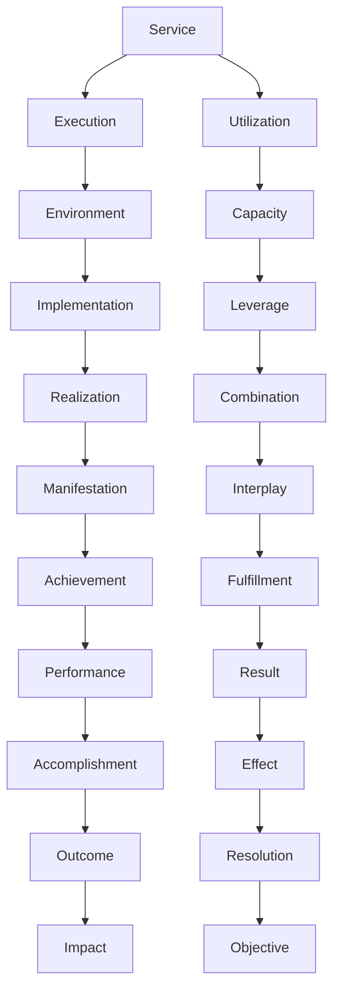
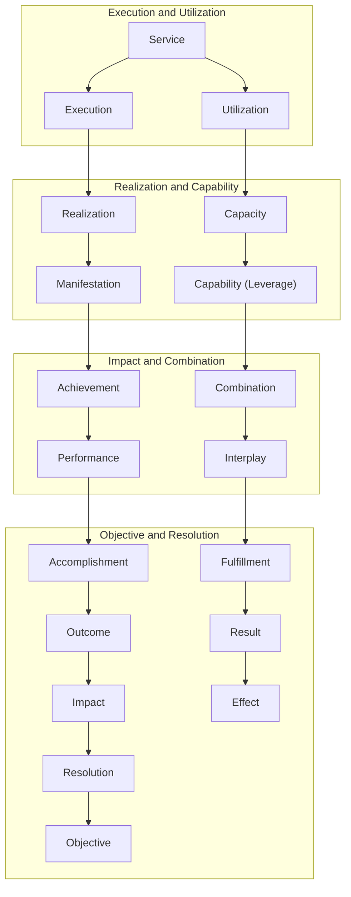

```mermaid 
graph TD;
    Service["Service"] --> 
Execution["Execution"];
    Execution --> Environment;
Environment --> Implementation["Implementation"];
    Implementation --> Realization["Realization"];
    Realization --> Manifestation["Manifestation"];
    Manifestation --> Achievement["Achievement"];
    Achievement --> Performance["Performance"];
    Performance --> Accomplishment["Accomplishment"];
    Accomplishment --> Outcome["Outcome"];
    Outcome --> Impact["Impact"];

    Service --> Utilization["Utilization"];
    Utilization --> 
    Capacity;
    Capacity --> Capability["Leverage"];
    Capability --> Combination["Combination"];
    Combination --> Interplay["Interplay"];
    Interplay --> Fulfillment["Fulfillment"];
    Fulfillment --> Result["Result"];
    Result --> Effect["Effect"];
    Effect --> Resolution["Resolution"];
    Resolution --> Objective 

```

# four levels

---

```mermaid 
graph TD;
    subgraph Level1[Execution and Utilization]
        Service["Service"] --> Execution["Execution"];
        Service --> Utilization["Utilization"];
    end

    subgraph Level2[Realization and Capability]
        Execution --> Realization["Realization"];
        Utilization --> Capacity["Capacity"];
        Realization --> Manifestation["Manifestation"];
        Capacity --> Capability["Capability (Leverage)"];
    end

    subgraph Level3[Impact and Combination]
        Manifestation --> Achievement["Achievement"];
        Capability --> Combination["Combination"];
        Achievement --> Performance["Performance"];
        Combination --> Interplay["Interplay"];
    end

    subgraph Level4[Objective and Resolution]
        Performance --> Accomplishment["Accomplishment"];
        Interplay --> Fulfillment["Fulfillment"];
        Accomplishment --> Outcome["Outcome"];
        Fulfillment --> Result["Result"];
        Outcome --> Impact["Impact"];
        Result --> Effect["Effect"];
        Impact --> Resolution["Resolution"];
        Resolution --> Objective["Objective"];
    end

```
