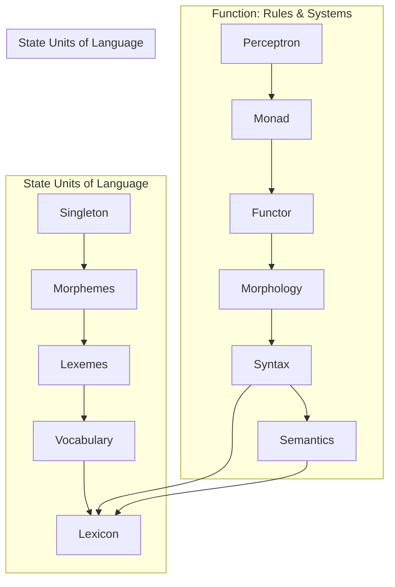

```mermaid
graph TD;
    subgraph State[State Units of Language]
        Singleton --> Morphemes;
        Morphemes --> Lexemes;
        Lexemes --> Vocabulary;
        Vocabulary --> Lexicon;
    end

    subgraph Function[Function: Rules & Systems]
        Perceptron --> Monad;
        Monad --> Functor;
        Functor --> Morphology;
        Morphology --> Syntax;
        Syntax --> Semantics;
    end
    subgraph Implementation[State Units of Language]
        Syntax --> Lexicon;
        Semantics --> Lexicon;
    end 

```
