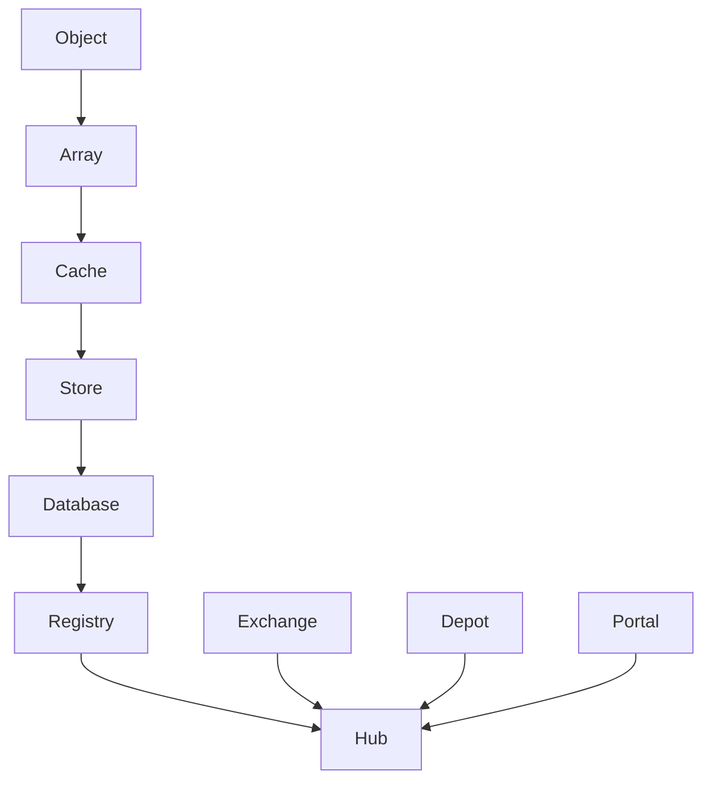
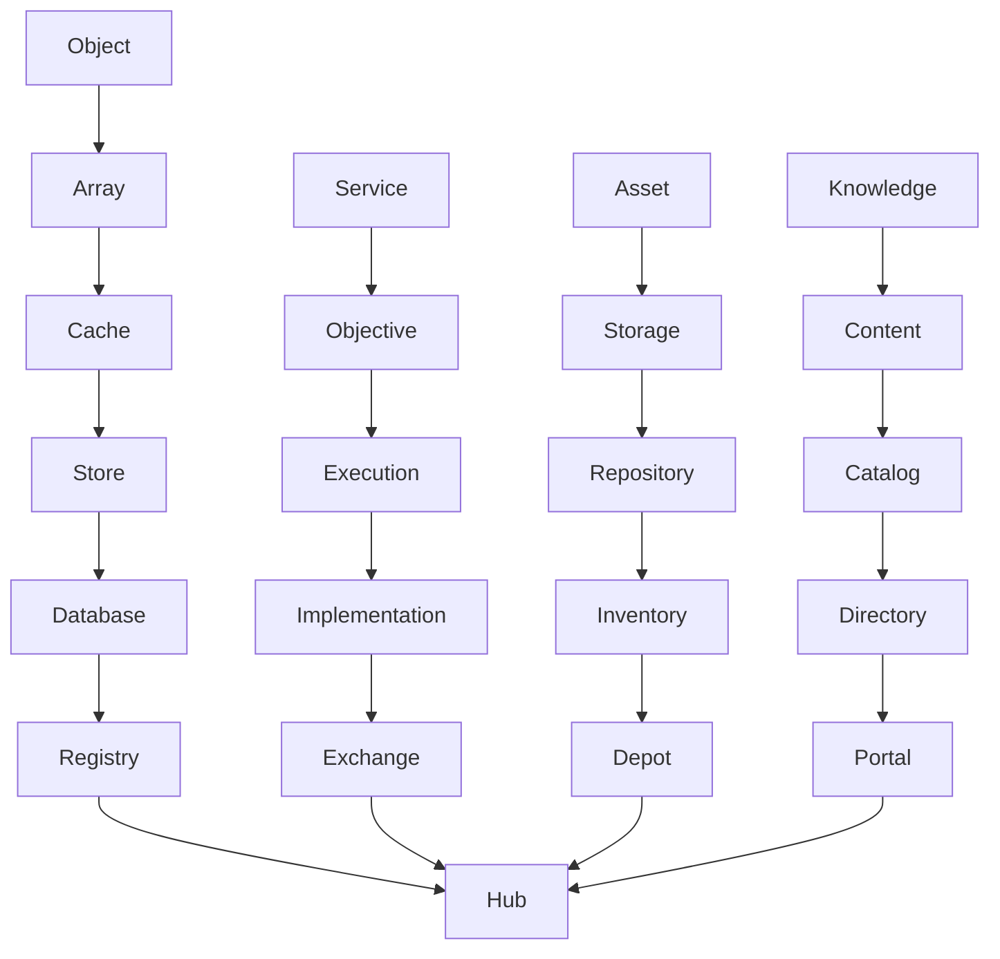

```mermaid
graph TD;
    Object --> Array;
    Array --> Cache
    Cache --> Store
    Store --> Database
    Database --> Registry
    


 
	Registry --> Hub
    Exchange --> Hub;
    Depot --> Hub;
    Portal --> Hub
```

---

Simple

```mermaid
graph TD;
    Object --> Array;
    Array --> Cache
    Cache --> Store
    Store --> Database
    Database --> Registry
    

    Service --> Objective
    Objective --> Execution
    Execution --> Implementation
    Implementation --> Exchange
    
    Asset --> Storage;
    Storage --> Repository;
    Repository --> Inventory;
    Inventory --> Depot;

    Knowledge --> Content
    Content --> Catalog
    Catalog --> Directory 
    Directory --> Portal

 
    Registry --> Hub
    Exchange --> Hub;
    Depot --> Hub;
    Portal --> Hub
```
