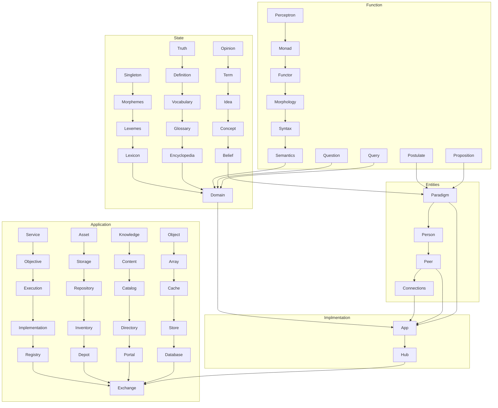

```mermaid
flowchart TD;

subgraph Entities
    Paradigm --> Person
    Person --> Peer
    Peer --> Connections
end

subgraph State
    Singleton --> Morphemes;
    Morphemes --> Lexemes;
    Lexemes --> Lexicon;
    Lexicon --> Domain;

    Truth --> Definition
    Definition --> Vocabulary
    Vocabulary --> Glossary
    Glossary --> Encyclopedia
    Encyclopedia --> Domain

    Opinion --> Term
    Term --> Idea
    Idea --> Concept
    Concept --> Belief
    Belief --> Paradigm

end

subgraph Application
    Service --> Objective
    Objective --> Execution
    Execution --> Implementation
    Implementation --> Registry
    Registry --> Exchange
    
    Asset --> Storage;
    Storage --> Repository;
    Repository --> Inventory;
    Inventory --> Depot;
    Depot --> Exchange;

    Knowledge --> Content
    Content --> Catalog
    Catalog --> Directory 
    Directory --> Portal
    Portal --> Exchange

    Object --> Array;
    Array --> Cache
    Cache --> Store
    Store --> Database
    Database --> Exchange
end

subgraph Function
    Perceptron --> Monad;
    Monad --> Functor;
    Functor --> Morphology;
    Morphology --> Syntax;
    Syntax --> Semantics;
    Semantics --> Domain;

    Question --> Domain
    Query --> Domain
    
    Postulate --> Paradigm
    Proposition --> Paradigm 
end

subgraph Implmentation
    Domain --> App
    Connections --> App
    Peer --> App
    Paradigm --> App 
    App --> Hub
    Hub --> Exchange
end
```
