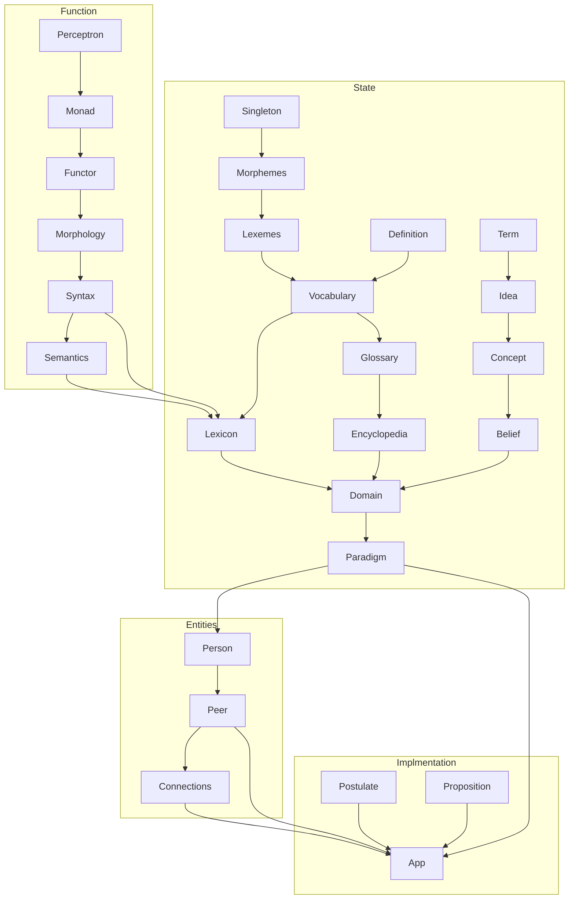

```mermaid
flowchart TD;

subgraph Entities
    Person --> Peer
    Peer --> Connections
end
subgraph State
    Singleton --> Morphemes;
    Morphemes --> Lexemes;
    Lexemes --> Vocabulary;
    Vocabulary --> Lexicon;
    Lexicon --> Domain;

    Definition --> Vocabulary
    Vocabulary --> Glossary
    Glossary --> Encyclopedia
    Encyclopedia --> Domain

    Term --> Idea
    Idea --> Concept
    Concept --> Belief
    Belief --> Domain
    
    Domain --> Paradigm
end

subgraph Function
    Perceptron --> Monad;
    Monad --> Functor;
    Functor --> Morphology;
    Morphology --> Syntax;
    Syntax --> Semantics;

    Syntax --> Lexicon;
    Semantics --> Lexicon;

end
subgraph Implmentation
    Paradigm --> Person
    Peer --> App
    Connections --> App
    Postulate --> App
    Proposition --> App 
    Paradigm --> App 
end
```

---

[[Should syntax and sematics be in the Lexicon or in the Domain]]

[[It looks like an overuse of domain paradigm]]