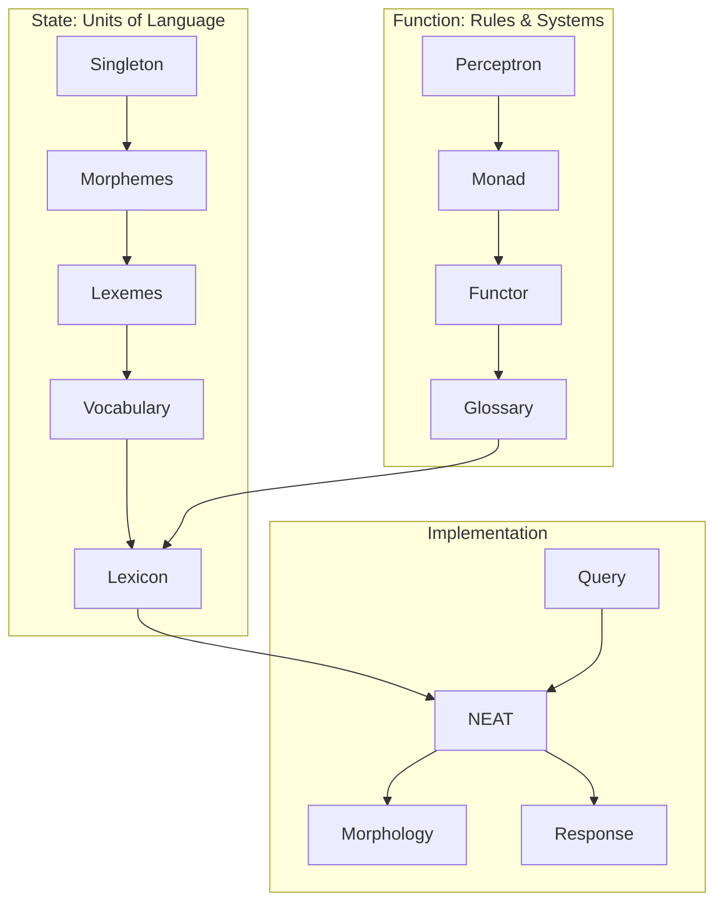

# unity-crypto-vault
Document Vault for Unity Cloud

---

I'm building a Decentralized data network on mosquitto mqtt CID().parse("monad") welo helia libp2p typescript For private protected and public data network with each item defined on the user's own computer on the root path in a graph database and each path is a single word that ties to the definition on the root path. That way if some one never connects to the network. If they share the same or similar data then it can still populate

I want the Singleton to be a model of defiend weights of single word nouns and pronouns and for the bias to be defined in the Monad, the Perceptron would decide if the query is linearly a valid defined monad. The Functor will be a NEAT network that takes in the Singleton as weights as a basis then takes in the the same monad and biases from libp2p peers and tains on that data.  the monads are definition to get a consues on that but the NEAT will also do all that to update the weights in the first epoch after that it will run the code together with a peer supplied tensor model in order to create an application.

Each device will manage its own access control and each path has a cid to its definition in time enough aliases. Maybe the neat can manage this. It can map all paths host paths to LEXEME paths and produce a system to run well defined rpc

For instance the neat will take Requests from other peers made by user and compare to accepted answers of user to train what ever plugged in tensorflow models subscribed to

When people can put in paths. Oh I forgot all the paths in in a cid for the specific data which enables privacy and decoupling of data 😅 or does this part even make sense now that I say it publicly However. The neat will be posted to with data from the mqtt broker and that data will be to a monad path of a package which will have instructions for the neat network which can build answers on all the data in the monad graph based on the packaged path

If the path after the Worker path includes data to be consumed by worker Okay I see. A worker is context dependent. But all the neat will do in the worker I implant on my root not will space a single generation one task sub task and return the results. It will only speed up data retrieval on separate network paths. It will allow for running multiple commands in stream from the mqtt broker

Different paths lead to different monad definitions which have a cid of a different blockstore. If data doesn't exist in current blockstore it must be retrieved from peers. The neat will spawn populations to find the data in different context. With access to multiple context graphs and ability to run multiple workers to compare results in a secario where no data guarantees execpt those pinned to own blockstore then neat has ability to mimic a llm or gpt with presentation of different biases and has ability to execute and evaluate plans if only just given instructions and access to private blockstore

it provides for dynamic user defined topologies and makes a comparative analysis based on the data encodings in the block store base on populating workers with shared data paths processed through weights and balances to produce a selectively shared digital to analog data transformer
I can use both as weights and biases at a path on the defined monad. But what it is is more I'm important than what it does. What ever path the neat worker is added to it will add in its functionality in a stream in the order of the path

what position of the path that it is in with receive data from the cid in the path before it in a stream. We will use Node js. But the messages are simple as plain text paths ready for a esp32 lora based mosquitto network . So with fast connects and disconnects and Topic that is subscribed to opens a up a connection the the main worker which opens sub workers based on Stream and publishes responses based on packages based on data in public private or protected data stores

I want to embed instructions on esp32 devices with 8mb ram and 8mb flash a mqtt broker to handle Crypto transactions and cid hashing
Also I wanted to use esp32 to use a small touch screen watch shaped module for $20 that has a 240 x 240 HD touchscreen to subscribe to paths , decode cid json and sign and publish messages. That could be the main Crypto key for connecting through Bluetooth or wifi to streaming the browsers paths to access data

Okay I want esp to hold cid strings. Cid parsing and wallet signing and verification the neat will be in js context with a mosquitto redis bridge

The mosquitto will broker data transfer. The redis and mosquitto will only be for a dectralized vs protected context. With lora and mqtt and esp32 the signing and verifying of data paths can enable transactions and with the neat as a bridge in the pipeline it will help improve transaction integrity and decentralization. A device lora mqtt device can be made for $20 which has free and open access to the network If the neat algorithm can be run on a esp32 with a coral tensor model. For $100 we can have an ai device that has access to shared modules which can be evaluated and ran in private worker context by neat and compare results. It should be able to refine any tensor model of the peers monad path it connects to

If the neat is set to dynamic adjust for memory and only compare request from similar paths of users within its bandwidth constraints will it not function as an ability to train based on all paths it can discover in the Peer network in generations cognizant of the bandwidth

Each population of each generation will be from a polling of peers sharing the same path that of course we have previously subscribed to. We will poll them for their weights and or biases and run a generation on our weights and biases. Or we can define the generations and epochs

Implementing NEAT to take requests from other peers, made by users, and compare these to accepted answers by the user to train TensorFlow models subscribed to, is a sophisticated approach that leverages both evolutionary algorithms and deep learning to enhance system intelligence over time. This strategy enables a personalized and adaptive learning experience, where the system evolves based on user feedback and peer interactions. Here’s a detailed look at how this could be operationalized:

we are using the NEAT as a perceptron but a single layer a single tick of polling Peer subscriptions the evolution part is to automate it 
It will compare all similar data calls on trusted peers and update training biases continuously ,
it will be a a scalable perceptron, a single layer, a single tick i for polling Peer subscriptions, 
the evolution part is to automate the applying of peers weight and or biases with the cuerrent covabulary and glossary

It helps build anti Singleton to get a better consensus on Singleton
The NEAT can also be used to infer Lexemes  in the vocabulary So it provides convergence to a singularity of knowledge from other peers

the NEAT is geard towards mutation and or data validation. It will provide a analog consensus of closest peers views of the same path. It can create infer meaning or define biases for anti definitions Lexemes that the NEAT can use to build a dynamic consensus on perception of a path while mitigate estoric definitions 

Imagine whatever weights and models we have a device to process we can only subscribe to their data by going to the path of the data to transform and having a bootstrap list of peers access signature we can subscribe to their weighs datagrams based on thier broadcasted weights and blockstore access

I want the same paths to run different data based on different context with based on different or shared definitions. In my system the monad is any path anything is the one thing and you can tabs it the way you want but if you want to take it the way you see it. Well fine. This neat monad is just a worker that helps refine and confirm a collaborative view

For instance the neat will take Requests from other peers made by user and compare to accepted answers of user to train what ever plugged in tensorflow models subscribed to

  
Each device will manage its own access control and each path has a cid to its definition in time enough aliases. Maybe the neat can manage this. It can map all paths host paths to monad paths and produce a system to run well defined rpc