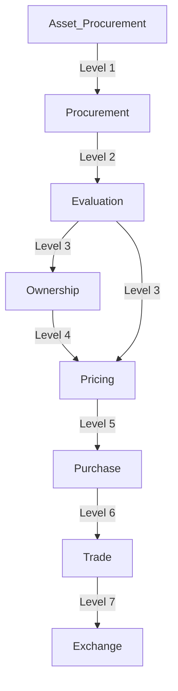
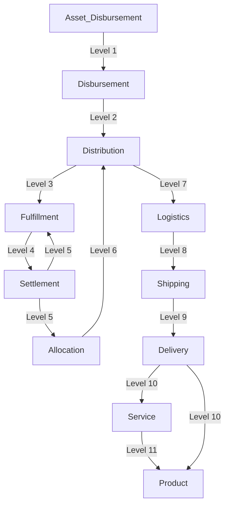
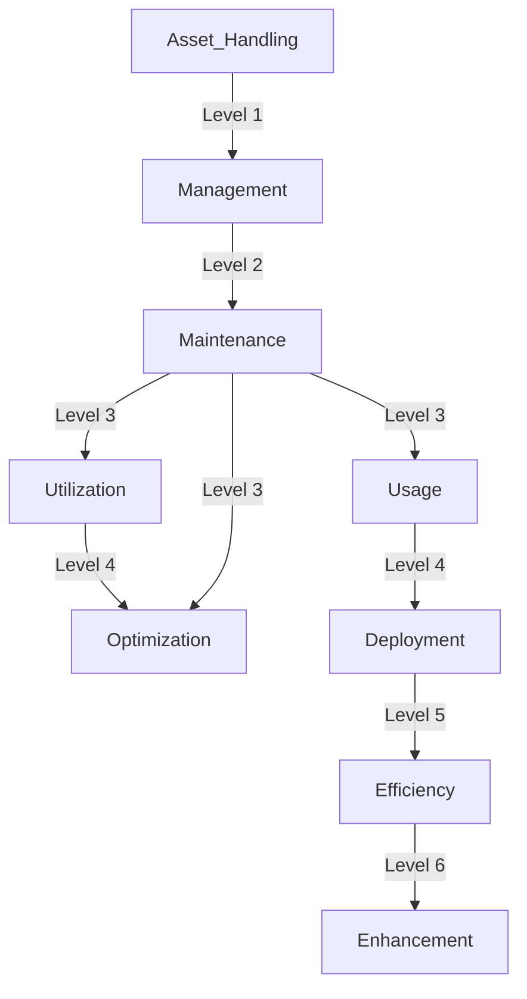

```mermaid
graph TD;

Asset_Procurement-->|Level 1| Procurement
Procurement-->|Level 2| Evaluation
Evaluation-->|Level 3| Ownership
Ownership-->|Level 4| Pricing
Pricing-->|Level 5| Purchase
Purchase-->|Level 6| Trade
Trade-->|Level 7| Exchange
Evaluation-->|Level 3| Pricing

```

```mermaid
graph TD;

Asset_Disbursement-->|Level 1| Disbursement
Disbursement-->|Level 2| Distribution
Distribution-->|Level 3| Fulfillment
Fulfillment-->|Level 4| Settlement
Settlement-->|Level 5| Allocation
Allocation-->|Level 6| Distribution
Distribution-->|Level 7| Logistics
Logistics-->|Level 8| Shipping
Shipping-->|Level 9| Delivery
Delivery-->|Level 10| Service
Service-->|Level 11| Product
Delivery-->|Level 10| Product
Settlement-->|Level 5| Fulfillment

```

```mermaid
graph TD;

Asset_Handling-->|Level 1| Management
Management-->|Level 2| Maintenance
Maintenance-->|Level 3| Utilization
Utilization-->|Level 4| Optimization
Maintenance-->|Level 3| Usage
Usage-->|Level 4| Deployment
Deployment-->|Level 5| Efficiency
Efficiency-->|Level 6| Enhancement
Maintenance-->|Level 3| Optimization

```