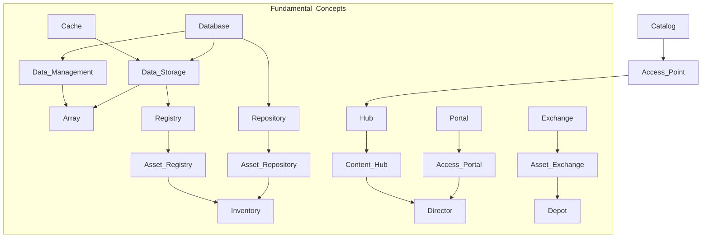

```

---
# links

```mermaid
graph TD;
    subgraph Fundamental_Concepts
        Database --> Data_Management
        Data_Management --> Array;
        Cache --> Data_Storage
        Data_Storage --> Array;
        Registry --> Asset_Registry
        Asset_Registry --> Inventory;
        Repository --> Asset_Repository
        Asset_Repository --> Inventory;
        Hub --> Content_Hub
        Content_Hub --> Director;
        Portal --> Access_Portal
        Access_Portal --> Director;
        Exchange --> Asset_Exchange
        Asset_Exchange --> Depot;
    end

    Catalog --> Access_Point --> Hub;
    Database --> Data_Storage --> Registry;
    Database --> Repository;

```
---