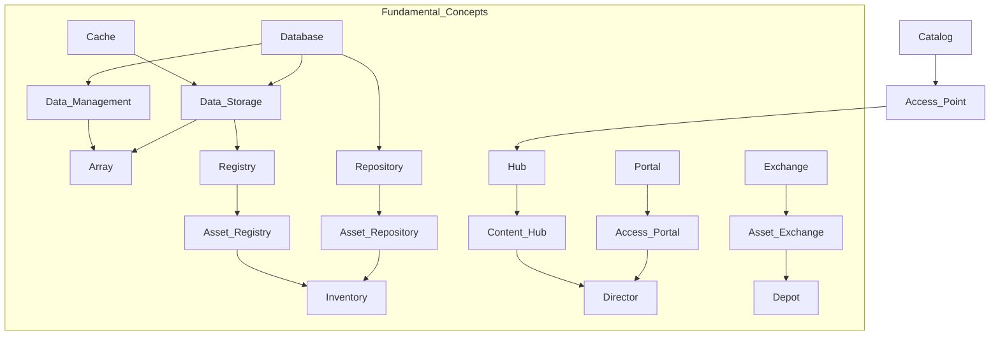
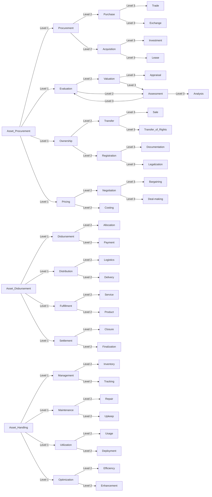
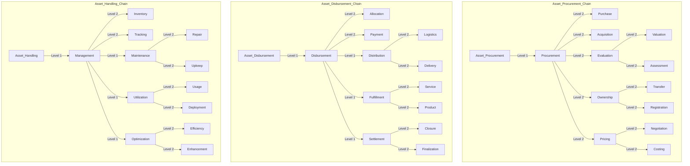

```

---
# links

```mermaid
graph TD;
    subgraph Fundamental_Concepts
        Database --> Data_Management
        Data_Management --> Array;
        Cache --> Data_Storage
        Data_Storage --> Array;
        Registry --> Asset_Registry
        Asset_Registry --> Inventory;
        Repository --> Asset_Repository
        Asset_Repository --> Inventory;
        Hub --> Content_Hub
        Content_Hub --> Director;
        Portal --> Access_Portal
        Access_Portal --> Director;
        Exchange --> Asset_Exchange
        Asset_Exchange --> Depot;
    end

    Catalog --> Access_Point --> Hub;
    Database --> Data_Storage --> Registry;
    Database --> Repository;

```
---

New from gpt loook good

```mermaid 
graph LR;

Asset_Procurement-->|Level 1| Procurement
Asset_Procurement-->|Level 1| Evaluation
Asset_Procurement-->|Level 1| Ownership
Asset_Procurement-->|Level 1| Pricing

Procurement-->|Level 2| Purchase
Procurement-->|Level 2| Acquisition

Evaluation-->|Level 2| Valuation
Evaluation-->|Level 2| Assessment

Ownership-->|Level 2| Transfer
Ownership-->|Level 2| Registration

Pricing-->|Level 2| Negotiation
Pricing-->|Level 2| Costing

Purchase-->|Level 3| Trade
Purchase-->|Level 3| Exchange

Acquisition-->|Level 3| Investment
Acquisition-->|Level 3| Lease

Valuation-->|Level 3| Appraisal
Valuation-->|Level 3| Assessment

Assessment-->|Level 3| Analysis
Assessment-->|Level 3| Evaluation

Transfer-->|Level 3| Sale
Transfer-->|Level 3| Transfer_of_Rights

Registration-->|Level 3| Documentation
Registration-->|Level 3| Legalization

Negotiation-->|Level 3| Bargaining
Negotiation-->|Level 3| Deal-making

Asset_Disbursement-->|Level 1| Disbursement
Asset_Disbursement-->|Level 1| Distribution
Asset_Disbursement-->|Level 1| Fulfillment
Asset_Disbursement-->|Level 1| Settlement

Disbursement-->|Level 2| Allocation
Disbursement-->|Level 2| Payment

Distribution-->|Level 2| Logistics
Distribution-->|Level 2| Delivery

Fulfillment-->|Level 2| Service
Fulfillment-->|Level 2| Product

Settlement-->|Level 2| Closure
Settlement-->|Level 2| Finalization

Asset_Handling-->|Level 1| Management
Asset_Handling-->|Level 1| Maintenance
Asset_Handling-->|Level 1| Utilization
Asset_Handling-->|Level 1| Optimization

Management-->|Level 2| Inventory
Management-->|Level 2| Tracking

Maintenance-->|Level 2| Repair
Maintenance-->|Level 2| Upkeep

Utilization-->|Level 2| Usage
Utilization-->|Level 2| Deployment

Optimization-->|Level 2| Efficiency
Optimization-->|Level 2| Enhancement
```

another view

```mermaid
graph TD;

subgraph Asset_Procurement_Chain
Asset_Procurement-->|Level 1| Procurement
Procurement-->|Level 2| Purchase
Procurement-->|Level 2| Acquisition
end

subgraph Asset_Disbursement_Chain
Asset_Disbursement-->|Level 1| Disbursement
Disbursement-->|Level 2| Allocation
Disbursement-->|Level 2| Payment
end

subgraph Asset_Handling_Chain
Asset_Handling-->|Level 1| Management
Management-->|Level 2| Inventory
Management-->|Level 2| Tracking
end

subgraph Asset_Procurement_Chain
Procurement-->|Level 2| Evaluation
Evaluation-->|Level 2| Valuation
Evaluation-->|Level 2| Assessment
end

subgraph Asset_Disbursement_Chain
Disbursement-->|Level 1| Distribution
Distribution-->|Level 2| Logistics
Distribution-->|Level 2| Delivery
end

subgraph Asset_Handling_Chain
Management-->|Level 1| Maintenance
Maintenance-->|Level 2| Repair
Maintenance-->|Level 2| Upkeep
end

subgraph Asset_Procurement_Chain
Procurement-->|Level 2| Ownership
Ownership-->|Level 2| Transfer
Ownership-->|Level 2| Registration
end

subgraph Asset_Disbursement_Chain
Disbursement-->|Level 1| Fulfillment
Fulfillment-->|Level 2| Service
Fulfillment-->|Level 2| Product
end

subgraph Asset_Handling_Chain
Management-->|Level 1| Utilization
Utilization-->|Level 2| Usage
Utilization-->|Level 2| Deployment
end

subgraph Asset_Procurement_Chain
Procurement-->|Level 2| Pricing
Pricing-->|Level 2| Negotiation
Pricing-->|Level 2| Costing
end

subgraph Asset_Disbursement_Chain
Disbursement-->|Level 1| Settlement
Settlement-->|Level 2| Closure
Settlement-->|Level 2| Finalization
end

subgraph Asset_Handling_Chain
Management-->|Level 1| Optimization
Optimization-->|Level 2| Efficiency
Optimization-->|Level 2| Enhancement
end

```