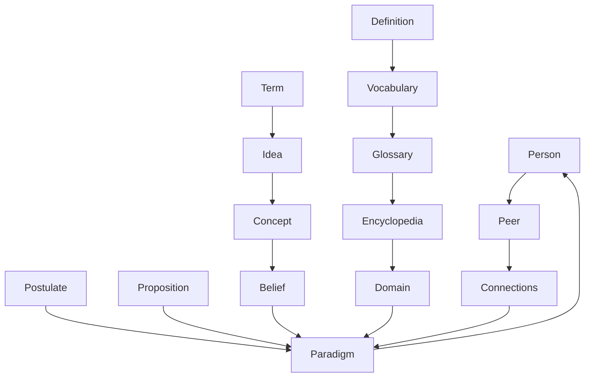
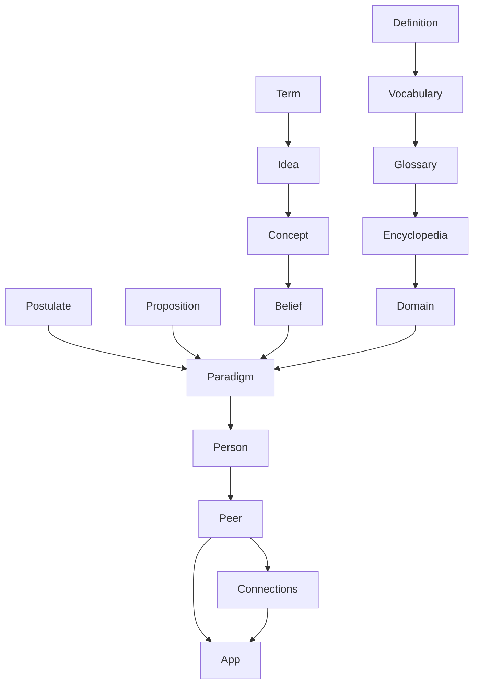
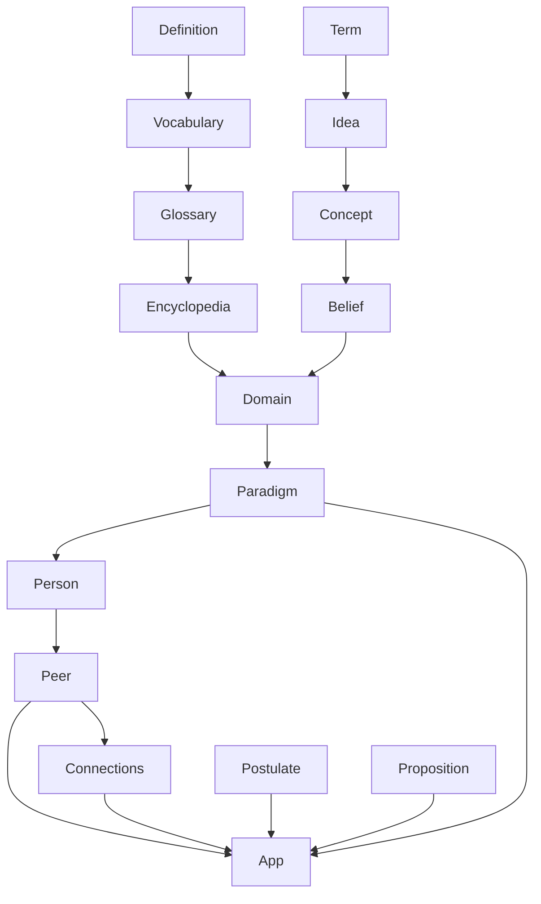
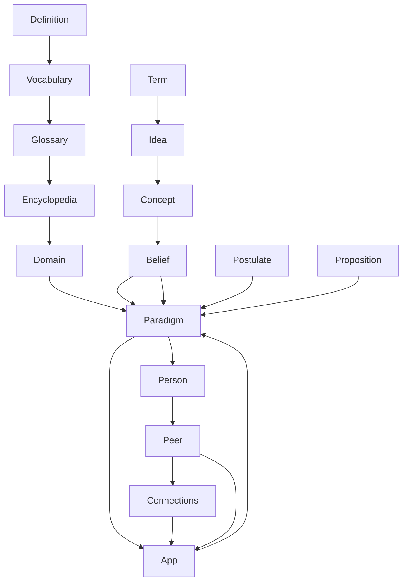
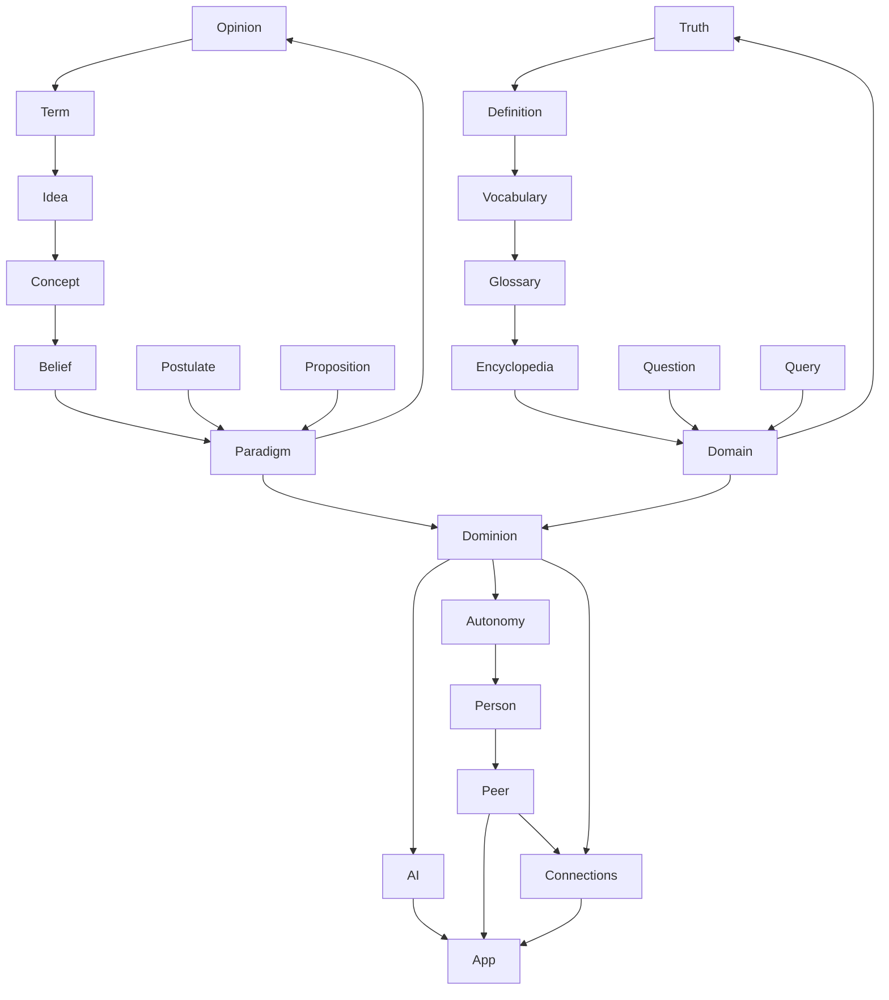

1. **Concept**: While concepts themselves are mental constructs and can relate to conscious thought, the word "concept" as described primarily refers to abstract ideas or notions and their linguistic representation. While the expression or understanding of concepts may involve consciousness, the word itself does not inherently describe consciousness.
    
2. **Idea**: Similar to "concept," the word "idea" can represent a thought or mental conception. Conscious thought processes are often involved in generating ideas, but the word itself does not explicitly describe consciousness.
    
3. **Term**: "Term" primarily refers to a word or expression used to describe something. While language and communication are closely tied to conscious thought and awareness, the word "term" itself does not directly describe consciousness.
    
4. **Definition**: The word "definition" refers to a statement explaining the meaning of a word or phrase. Definitions are products of conscious cognitive processes, as they involve understanding and articulating meanings. However, the word "definition" itself does not inherently describe consciousness.
    
5. **Conception**: While "conception" can refer to the act of conceiving ideas or notions, it also has a biological meaning related to fertilization. In the context of mental activity, the word "conception" may relate to conscious thought processes involved in generating ideas, but it does not directly describe consciousness itself.
    
6. **Paradigm**: "Paradigm" typically denotes a typical example or pattern. While the understanding and recognition of patterns can involve conscious awareness, the word "paradigm" itself does not explicitly describe consciousness.
    
7. **Postulate**: "Postulate" refers to a fundamental assumption or principle. While the formation and consideration of hypotheses or assumptions may involve conscious reasoning, the word "postulate" does not inherently describe consciousness.
    
8. **Proposition**: This word was not described in your text. However, a proposition typically refers to a statement or assertion. Conscious thought and communication are involved in making propositions, but the word itself does not directly describe consciousness.

1

2

3

4

5

