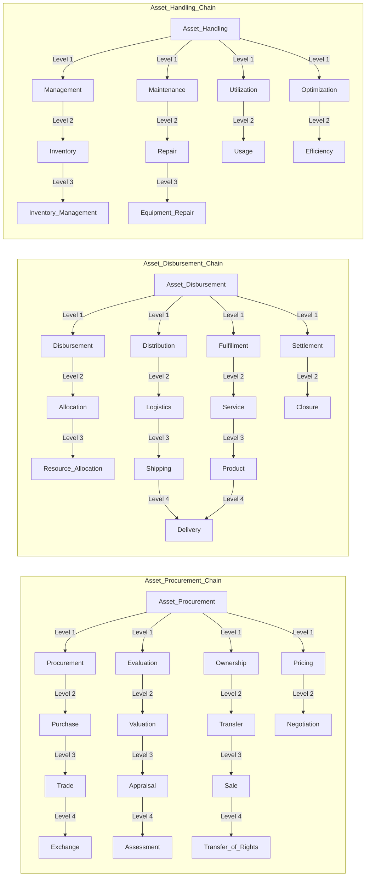
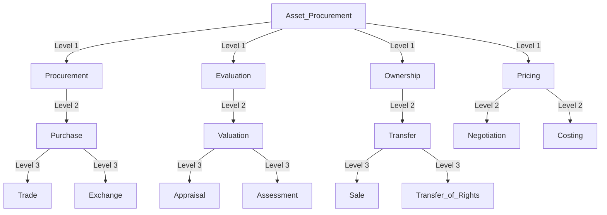
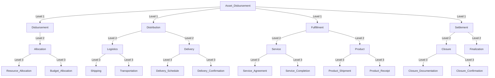
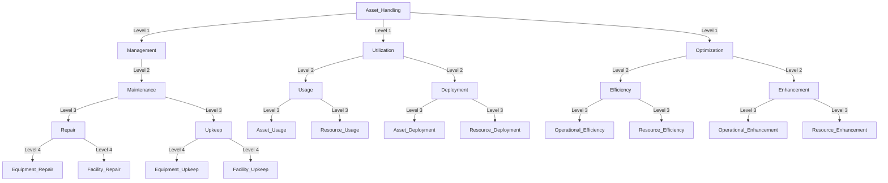

```mermaid
graph LR;

subgraph Asset_Procurement_Chain
Asset_Procurement-->|Level 1| Procurement
Procurement-->|Level 2| Purchase
Purchase-->|Level 3| Trade
Trade-->|Level 4| Exchange
end

subgraph Asset_Procurement_Chain
Asset_Procurement-->|Level 1| Evaluation
Evaluation-->|Level 2| Valuation
Valuation-->|Level 3| Appraisal
Appraisal-->|Level 4| Assessment
end

subgraph Asset_Procurement_Chain
Asset_Procurement-->|Level 1| Ownership
Ownership-->|Level 2| Transfer
Transfer-->|Level 3| Sale
Sale-->|Level 4| Transfer_of_Rights
end

subgraph Asset_Procurement_Chain
Asset_Procurement-->|Level 1| Pricing
Pricing-->|Level 2| Negotiation
end

subgraph Asset_Disbursement_Chain
Asset_Disbursement-->|Level 1| Disbursement
Disbursement-->|Level 2| Allocation
Allocation-->|Level 3| Resource_Allocation
end

subgraph Asset_Disbursement_Chain
Asset_Disbursement-->|Level 1| Distribution
Distribution-->|Level 2| Logistics
Logistics-->|Level 3| Shipping
Shipping-->|Level 4| Delivery
end

subgraph Asset_Disbursement_Chain
Asset_Disbursement-->|Level 1| Fulfillment
Fulfillment-->|Level 2| Service
Service-->|Level 3| Product
Product-->|Level 4| Delivery
end

subgraph Asset_Disbursement_Chain
Asset_Disbursement-->|Level 1| Settlement
Settlement-->|Level 2| Closure
end

subgraph Asset_Handling_Chain
Asset_Handling-->|Level 1| Management
Management-->|Level 2| Inventory
Inventory-->|Level 3| Inventory_Management
end

subgraph Asset_Handling_Chain
Asset_Handling-->|Level 1| Maintenance
Maintenance-->|Level 2| Repair
Repair-->|Level 3| Equipment_Repair
end

subgraph Asset_Handling_Chain
Asset_Handling-->|Level 1| Utilization
Utilization-->|Level 2| Usage
end

subgraph Asset_Handling_Chain
Asset_Handling-->|Level 1| Optimization
Optimization-->|Level 2| Efficiency
end

```

```mermaid
graph TD;

Asset_Procurement-->|Level 1| Procurement
Procurement-->|Level 2| Purchase
Purchase-->|Level 3| Trade
Purchase-->|Level 3| Exchange

Asset_Procurement-->|Level 1| Evaluation
Evaluation-->|Level 2| Valuation
Valuation-->|Level 3| Appraisal
Valuation-->|Level 3| Assessment

Asset_Procurement-->|Level 1| Ownership
Ownership-->|Level 2| Transfer
Transfer-->|Level 3| Sale
Transfer-->|Level 3| Transfer_of_Rights

Asset_Procurement-->|Level 1| Pricing
Pricing-->|Level 2| Negotiation
Pricing-->|Level 2| Costing

```

```mermaid
graph TD;

Asset_Disbursement-->|Level 1| Disbursement
Disbursement-->|Level 2| Allocation
Allocation-->|Level 3| Resource_Allocation
Allocation-->|Level 3| Budget_Allocation

Asset_Disbursement-->|Level 1| Distribution
Distribution-->|Level 2| Logistics
Logistics-->|Level 3| Shipping
Logistics-->|Level 3| Transportation
Distribution-->|Level 2| Delivery
Delivery-->|Level 3| Delivery_Schedule
Delivery-->|Level 3| Delivery_Confirmation

Asset_Disbursement-->|Level 1| Fulfillment
Fulfillment-->|Level 2| Service
Service-->|Level 3| Service_Agreement
Service-->|Level 3| Service_Completion
Fulfillment-->|Level 2| Product
Product-->|Level 3| Product_Shipment
Product-->|Level 3| Product_Receipt

Asset_Disbursement-->|Level 1| Settlement
Settlement-->|Level 2| Closure
Closure-->|Level 3| Closure_Documentation
Closure-->|Level 3| Closure_Confirmation
Settlement-->|Level 2| Finalization

```

```mermaid
graph TD;

Asset_Handling-->|Level 1| Management
Management-->|Level 2| Maintenance
Maintenance-->|Level 3| Repair
Repair-->|Level 4| Equipment_Repair
Repair-->|Level 4| Facility_Repair
Maintenance-->|Level 3| Upkeep
Upkeep-->|Level 4| Equipment_Upkeep
Upkeep-->|Level 4| Facility_Upkeep

Asset_Handling-->|Level 1| Utilization
Utilization-->|Level 2| Usage
Usage-->|Level 3| Asset_Usage
Usage-->|Level 3| Resource_Usage
Utilization-->|Level 2| Deployment
Deployment-->|Level 3| Asset_Deployment
Deployment-->|Level 3| Resource_Deployment

Asset_Handling-->|Level 1| Optimization
Optimization-->|Level 2| Efficiency
Efficiency-->|Level 3| Operational_Efficiency
Efficiency-->|Level 3| Resource_Efficiency
Optimization-->|Level 2| Enhancement
Enhancement-->|Level 3| Operational_Enhancement
Enhancement-->|Level 3| Resource_Enhancement

```
